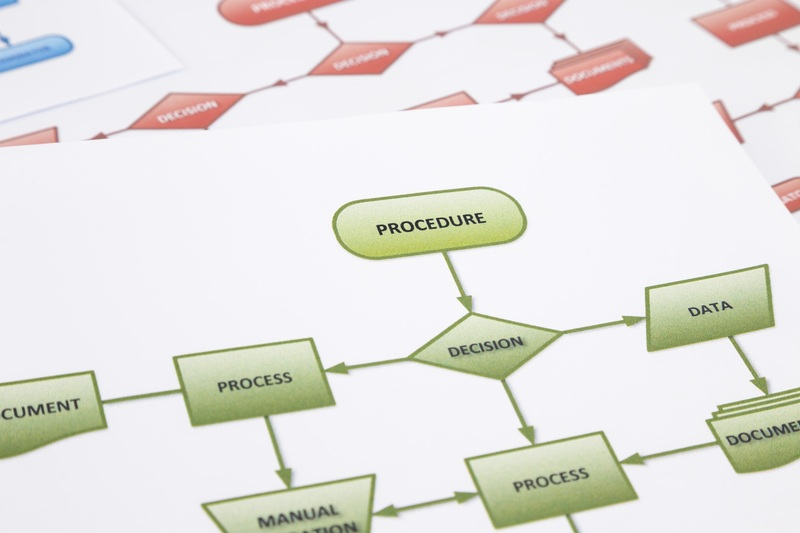
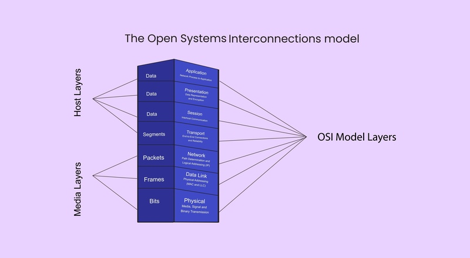

## Konsep Dasar Desain Sistem

### **A. Definisi Desain Sistem**
Desain sistem adalah tahap transisi dari analisis kebutuhan ke implementasi fisik. Ini adalah proses mendefinisikan arsitektur, komponen, modul, antarmuka, dan data dari sistem untuk memenuhi kebutuhan-kebutuhan yang telah ditentukan pada tahap analisis. Secara sederhana, jika analisis sistem berfokus pada *"apa yang dibutuhkan"*, maka desain sistem berfokus pada *"bagaimana cara membangunnya"*.

### **B. Tujuan Desain Sistem**
Tujuan utama dari tahap desain sistem adalah untuk menghasilkan cetak biru (*blueprint*) yang lengkap bagi para programmer dan teknisi. Secara spesifik, tujuannya mencakup:
* **Efisiensi & Efektivitas:** Merancang sistem yang dapat memproses data dengan cepat dan memberikan output yang akurat.
* **Reliabilitas (Keandalan):** Memastikan sistem berjalan stabil dan meminimalkan kegagalan (bug/error).
* **Fleksibilitas:** Merancang sistem yang mudah dipelihara (*maintainable*) dan dikembangkan di masa depan.
* **Ekonomis:** Memastikan solusi yang dirancang sesuai dengan anggaran dan sumber daya yang tersedia.
* **User Friendly:** Menciptakan antarmuka yang mudah dipahami dan digunakan oleh pengguna akhir.

### **C. Perbedaan Desain Sistem Secara Umum & Terinci**

| Aspek | Desain Sistem Secara Umum (Makro/Logis) | Desain Sistem Secara Terinci (Mikro/Fisik) |
| :--- | :--- | :--- |
| **Fokus** | Gambaran besar sistem dan hubungannya dengan pengguna. | Spesifikasi teknis mendalam untuk implementasi kode. |
| **Target Audiens** | Manajer dan Pengguna (User). | Programmer dan Teknisi Sistem. |
| **Isi** | Desain input/output, desain antarmuka (UI), dan alur kerja logis. | Struktur database (skema), algoritma program, spesifikasi hardware, dan desain jaringan. |
| **Sifat** | Konseptual (bagaimana sistem terlihat). | Teknis (bagaimana sistem bekerja di balik layar). |

---

## Desain Sistem Pendekatan Terstruktur (*Structured Approach*)

Pendekatan terstruktur adalah metode klasik yang memandang sistem sebagai kumpulan **proses** atau fungsi yang berinteraksi dengan data. Pendekatan ini bersifat *top-down* (dari umum ke khusus) dan memisahkan data dari proses.

 

### **1. Alat Permodelan (Modeling Tools)**
Alat-alat dalam pendekatan terstruktur berfokus pada aliran data:
* **DFD (Data Flow Diagram):** Menggambarkan bagaimana data mengalir melalui sistem, diproses, dan disimpan.
* **Kamus Data (Data Dictionary):** Katalog fakta tentang data dan kebutuhan-kebutuhan informasi.
* **Flowchart (Bagan Alir):** Menggambarkan logika prosedural dan langkah-langkah algoritma.
* **Structure Chart:** Menunjukkan hirarki modul program dan hubungan antar modul.
* **ERD (Entity Relationship Diagram):** Memodelkan struktur data dan hubungan antar tabel.

### **2. Sistem Operasi**
Pendekatan ini sering dikaitkan dengan lingkungan yang sangat prosedural atau *batch processing*, meskipun bisa berjalan di OS modern. Lingkungan yang umum meliputi:
* **Unix/Linux:** Sangat kuat dalam pemrosesan berbasis perintah (CLI) dan skrip prosedural.
* **Mainframe OS (z/OS):** Untuk pemrosesan data transaksi besar.
* **Sistem Tertanam (Embedded Systems):** Sering menggunakan pendekatan terstruktur untuk efisiensi memori yang ketat.

### **3. Bahasa Pemrograman**
Bahasa yang digunakan adalah bahasa prosedural yang mengeksekusi instruksi secara berurutan:
* **C:** Bahasa prosedural standar industri.
* **Pascal:** Sering digunakan untuk pembelajaran logika terstruktur.
* **COBOL:** Umum di perbankan/mainframe.
* **Fortran:** Untuk komputasi saintifik.

---

## Desain Sistem Pendekatan Berorientasi Objek (*Object-Oriented Approach*)

Pendekatan berorientasi objek (OOP) memandang sistem sebagai kumpulan **objek** yang saling berinteraksi. Setiap objek menggabungkan data (atribut) dan perilaku (metode/fungsi) menjadi satu kesatuan (enkapsulasi).

 

### **1. Alat Permodelan (Modeling Tools)**
Standar emas untuk desain berorientasi objek adalah **UML (Unified Modeling Language)**. Diagram utamanya meliputi:
* **Use Case Diagram:** Menggambarkan interaksi antara pengguna (aktor) dengan sistem (fungsionalitas).
* **Class Diagram:** Menggambarkan struktur statis sistem, kelas-kelas, atribut, metode, dan hubungan antar kelas.
* **Sequence Diagram:** Menggambarkan interaksi antar objek berdasarkan urutan waktu.
* **Activity Diagram:** Menggambarkan alur kerja aktivitas dalam sistem (mirip flowchart tapi support paralelisme).

### **2. Sistem Operasi**
Pendekatan ini mendominasi pengembangan aplikasi modern yang membutuhkan antarmuka grafis (GUI) dan respons *event-driven*:
* **Windows, macOS, Modern Linux (Distro Desktop):** Mendukung aplikasi GUI yang kompleks berbasis objek.
* **Android & iOS:** Sistem operasi mobile ini sepenuhnya dibangun di atas konsep objek (View, Activity, Controller).

### **3. Bahasa Pemrograman**
Bahasa yang mendukung konsep *Class*, *Inheritance* (Pewarisan), *Polymorphism*, dan *Encapsulation*:
* **Java:** Sangat populer untuk aplikasi enterprise dan Android.
* **C++:** Pengembangan dari C dengan fitur objek.
* **C#:** Bahasa utama ekosistem Microsoft .NET.
* **Python:** Mendukung multi-paradigma termasuk OOP yang sangat kuat.
* **PHP (Modern):** Kerangka kerja (framework) web modern seperti Laravel menggunakan konsep OOP penuh.
