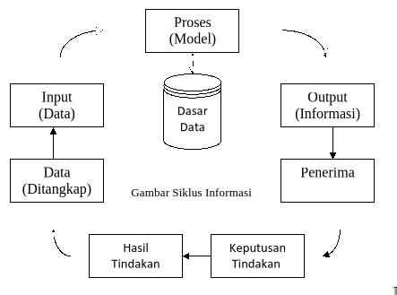

# Konsep Dasar Sistem 

## Definisi Sistem 
Kumpulan unsur-unsur yang saling berinteraksi satu  dengan yang lain untuk menghasilkan tujuan.

## Karakteristik Sistem 
sifat-sifat khusus yang dimiliki oleh sistem

1. Komponen Sistem
    Suatu sistem terdiri dari sejumlah komponen yang saling berinteraksi yang berarti saling bekerja sama membentuk satu kesatuan.
2. Batas Sistem
    Batas sistem merupakan daerah yang membatasi antara suatu sistem dengan sistem yang lainnya atau dengan lingkungan luarnya.
3. Lingkungan Luar Sistem
    Lingkungan luar dari suatu sistem adalah apapun diluar batas dari sistem yang mempengaruhi operasi sistem. Lingkungan luar sistem dapat bersifat menguntungkan dan merugikan.
4. Penghubung Sistem
    Penghubung sistem merupakan media penghubung antara satu subsistem dengan subsistem yang lain.
5. Masukan Sistem
    Masukan adalah energi yang dimasukan ke dalam sistem. Masukan dapat berupa masukan perawatan dan masukan sinyal. Masukan perawatan adalah energi yang dimasukkan supaya sistem tersebut dapat dioperasikan. Masukan sinyal adalah energi yang diproses untuk didapatkan keluaran.
6. Keluaran Sistem
    Keluaran sistem adalah hasil dari energi yang diolah dan diklasifikasikan menjadi keluaran yang berguna dan sisa pembuangan.
7. Pengolah Sistem
: Suatu sistem dapat mempunyai suatu bagian pengolahan yang akan merubah masukan menjadi keluaran.
8. Tujuan Sistem
: Suatu sistem pasti mempunyai tujuan. Kalau suatu sistem tidak mempunyai tujuan, maka operasi sistem tidak  akan ada gunanya.

## Klasifikasi Sistem
Sistem dapat digolongkan menjadi beberapa jenis, yaitu:

### Sistem Abstrak  X  Sistem Fisik
Sistem abstrak adalah sistem yang berupa pemikiran atau ide-ide yang tidak tampak secara fisik. Contoh : Sistem Teologi yang menerangkan hubungan manusia dengan Tuhan.
Sedangkan sistem fisik merupakan sistem yang ada secara fisik. Contoh : Sistem Komputer, Sistem Keuangan  

### Sistem Alamiah  X  Sistem Buatan Manusia
Sistem alamiah adalah sistem yang terjadi melalui proses alam tidak tidak dibuat oleh manusia. Contoh pada sistem alamiah: sistem peredaran bumi. Sedangkan sistem buatan manusia adalah sistem yang dirancang oleh manusia. Contoh: sistem robotika

### Sistem Deterministik  X  Sistem Probabilistik
Sistem deterministik adalah sistem yang berinteraksi antara bagiannya yang dapat diprediksi secara pasti. Contoh: sistem komputer. Sedangkan sistem probabilistik adalah sistem yang tidak bisa diprediksikan secara pasti. Contoh: sistem manusia

### Sistem Tertutup  X  Sistem Terbuka
Sistem tertutup adalah sistem yang tidak berhubungan dan tidak terpengaruh oleh lingkungan luar. Contoh : tabung reaksi. Sedangkan sistem terbuka adalah sistem yang berhubungan dan terpengaruh oleh lingkungan luar. Contoh : sistem organisasi

# Konsep Dasar Informasi

## Definisi Data & Informasi
Data yang diolah menjadi bentuk yang lebih berguna bagi penerimanya 

Tingkatan Data
- Character
- Field
- File
- Database

## Siklus Informasi

 

## Contoh Penggunaan Data dan Informasi yang dihasilkan pada perancangan sistem informasi.

## Mutu Informasi: Kualitas & Nilai Informasi.

a.Kualitas informasi tergantung dari 3 (tiga) hal :
    1. Informasi harus akurat: :	informasi harus terbebas dari kesalahan-kesalahan, tidak bias dan tidak menyesatkan
    2. Informasi harus tepat waktu: :	informasi yang datang kepada penerimanya tidak boleh mengalami keterlambatan
    3. Informasi harus relevan: :	informasi memiliki manfaat bagi penerimanya

b.Nilai informasi ditentukan oleh 2 (dua) hal :
        1. Manfaat dari informasi tersebut
        2. Biaya untuk mendapatkan informasi 

# Konsep Dasar Sistem Informasi

## Definisi Sistem Informasi

Suatu sistem di dalam suatu organisasi yang mempertemukan kebutuhan pengolahan transaksi harian, mendukung operasi, bersifat manajerial dan kegiatan strategi  dari suatu organisasi dan menyediakan pihak luar tertentu dengan laporan-laporan yang diperlukan.

## Komponen-Komponen Sistem Informasi:

- HARDWARE: media input, media proses, media output, media simpanan luar 
- SOFTWARE: sistem operasi, bahasa pemrograman, paket aplikasinya
- DATABASE: Kumpulan File-File yang saling berhubungan. 

Tingkatan Data: character, field: NIM-> 12345, Record #1-> NIM, Nama_MHS, Prodi, Fakultas. File-> MHS #1 s/d #499 

- PROSEDUR: alur kerja dari sebuah sistem. Ruang Lingkup Sistem.
Tentukan Ruang Lingkup Sistem pada perancangan Sistem Informasi Penerimaan Mahasiswa Baru Pada Univ. Muhammadiyah Cirebon.

    1. Pendaftaran Mhs Baru
    2. Pengecekan Persyaratan Pendaftaran
    3. Penyeleksian Mhs Baru
    4. Penerimaan Mhs Baru
    5. Registrasi Ulang
    6. Penentuan Program Studi
    7. Pembagian Kelas

- USER & ADM
  

## Peranan Sistem Informasi Bagi Manajemen:

1. Dapat mendukung dalam pengambilan keputusan
2. Dapat mendukung kegiatan manajemen

Yang termasuk ke dalam kegiatan manajemen adalah:: 		
    1. Perencanaan strategis
        a. Proses evaluasi lingkungan luar organisasi : harus mampu bereaksi terhadap kesempatan-kesempatan dari lingkungan luar dan tanggap terhadap tekanan-tekanan dari lingkungan luar.
        b. Penetapan tujuan
Tujuan adalah apa yang ingin dicapai oleh organisasi. Tujuan ditetapkan oleh manajemen tingkat atas di dalam proses perencanaan strategis yang bersifat jangka panjang.
        c. Penentuan strategis
Menentukan tindakan-tindakan yang harus dilakukan oleh organisasi  dengan maksud untuk mencapai tujuan-tujuannya.
    2. Pengendalian manajemen
Yaitu proses untuk meyakinkan bahwa organisasi telah menjalankan strategi yang sudah ditetapkan  dengan efektif dan efisien. 
    3. Pengendalian operasiTanggal
Yaitu proses untuk meyakinkan bahwa tiap-tiap tugas tertentu telah dilaksanakan secara efektif dan efisien.

## Komponen-Komponen Sistem Informasi.

1. Perangkat Keras (Hardware).
    a. Media Input: keyboard, mouse, scanner
    b. Media Proses: prosessor
    c. Media Output: monitor, printer
    d. Media Simpanan Luar: harddisk, flashdisk, compact disk

2. Perangkat Lunak (Software)
    a.Sistem Operasi: Windows
    b.Bahasa Pemrograman: PHP
    c.Perangkat Aplikasi: visio, flash, dreamweaver

3. Prosedur: tahapan kerja dari sistem. Ruang lingkup sistem informasi akademik berbasis web: prosedur pengajuan KRS, prosedur kegiatan belajar mengajar, prosedur pengolah data nilai, prosedur pembuatan laporan dll.

Pada Perancangan Sistem Informasi Penjualan Android: prosedur pendaftaran, login, pemesanan order, konfirmasi barang dll.

4. Penggunaan Basis Data: mata_kuliah, dosen, mahasiswa, nilai, jadwal, ruang_kuliah, presensi_dosen, presensi_mhs, KRS dsb.

Perancangan Sistem Informasi Penjualan Berbasis Android: supplier, konsumen, sales, produk, pemesanan, konf_order, penjualan, pembayaran, konf_bayar, kirim, konf_kirim dll

5. Hak Akses Admin & User.
    Admin: staf di bagian akademik, staf di bagian keu, staf di fakultas, staf di prodi
    User: mahasiswa, dosen, kaprodi, dekan dll

# Tata Kelola Sistem Informasi

## Definisi
Tata kelola Sistem Informasi (IT Governance) adalah kerangka kerja yang terdiri dari proses, struktur, dan mekanisme yang digunakan untuk mengarahkan, mengendalikan, dan mengawasi penggunaan teknologi informasi dalam suatu organisasi. Tujuannya adalah untuk memastikan bahwa investasi TI selaras dengan tujuan bisnis, memberikan nilai tambah, mengelola risiko, dan memastikan pemanfaatan sumber daya TI yang optimal.

## Framework Pengembangan Sistem
Berikut beberapa framework yang umum digunakan dalam tata kelola sistem informasi:

### 1. COBIT (Control Objectives for Information and Related Technologies)
- Framework komprehensif untuk tata kelola dan manajemen TI
- Menyediakan alat untuk mengukur dan memantau kinerja TI
- Fokus pada alignment TI dengan tujuan bisnis

### 2. ITIL (Information Technology Infrastructure Library)
- Framework untuk manajemen layanan TI
- Menekankan pada delivery layanan TI yang berkualitas
- Mencakup proses seperti incident management, change management

### 3. ISO/IEC 27001
- Standar internasional untuk manajemen keamanan informasi
- Fokus pada pengendalian risiko keamanan informasi
- Membangun sistem manajemen keamanan informasi (ISMS)

### 4. COSO (Committee of Sponsoring Organizations)
- Framework untuk pengendalian internal perusahaan
- Mencakup aspek pengendalian lingkungan, risiko, dan monitoring
- Diterapkan dalam konteks tata kelola TI

### 5. TOGAF (The Open Group Architecture Framework)
- Framework untuk enterprise architecture
- Membantu merancang arsitektur TI yang selaras dengan bisnis
- Menyediakan metodologi pengembangan yang terstruktur

## Jurnal Nasional/Internasional yang Relevan:

### ANALISIS KINERJA TATA KELOLA TEKNOLOGI INFORMASI MENGGUNAKAN FRAMEWORK COBIT 2019 PADA UNIVERSITAS JABAL GHAFUR
**Penulis:** Salimuddin Salimuddin, Munirul Ula, Nurdin Nurdin

**Tahun Terbit:** 2025

**Ringkasan:** Tujuan: Mengevaluasi Tata Kelola TI di Unigha menggunakan COBIT 2019 (EDM03 & MEA03). Metode: Kuantitatif (Kuesioner) dengan responden RACI Chart. Hasil: Kapabilitas Level 1 (100%), Level 2 Largely Achieved. Terdapat kesenjangan (gap) sebesar 3 level menuju target Level 4. Rekomendasi meliputi pembaruan kebijakan internal dan pelatihan SDM.

**Review:** Kelebihan: Penerapan kerangka COBIT 2019 yang spesifik dalam konteks Perguruan Tinggi di Indonesia. Memberikan gap analysis yang jelas antara kondisi as-is dan target to-be. 

**Kekurangan:** Fokus terbatas pada dua domain COBIT. Hasil Level 1/2 menunjukkan maturitas yang sangat rendah, yang mungkin dipengaruhi oleh keterbatasan implementasi instrumen atau bias responden.

**Sumber:** https://doi.org/10.23960/jitet.v13i2.6130

### Urgensi Akreditasi Perguruan Tinggi di Indonesia
**Penulis:** Muh. Ihsan, Muchammad Eka Mahmud

**Tahun Terbit:** 2025

**Ringkasan:** Tujuan: Mengkaji makna dan urgensi Akreditasi PT. Metode: Kajian Literatur (Literature Review) dari berbagai dokumen terkait (jurnal, buku). Hasil: Akreditasi merupakan penentuan standar kualitas yang meningkatkan reputasi, kepercayaan publik, dan menjadi prasyarat untuk akses pendanaan/hibah bagi institusi. Akreditasi merupakan upaya pemerintah untuk menstandardisasi mutu lulusan.

**Review:** Kelebihan: Menyediakan kerangka konseptual yang sangat relevan, menyoroti dampak Akreditasi pada aspek reputasi dan finansial institusi. 

Kekurangan: Karena sifatnya kajian literatur, artikel ini kurang membahas dinamika implementasi standar akreditasi yang berubah-ubah (misalnya, IAPS 4.0) atau tantangan internal yang dihadapi PT dalam pengumpulan data dan pelaporan.

**Sumber:** https://ejournal.stitsyambtg.ac.id/index.php/nabawi/article/view/119

### Dashboard Monitoring Alumni dengan Teknologi Business Intelligence pada Sistem Tracer Study Undiksha
**Penulis:** Made Diah Arista Devi, I Gusti Ayu Agung Diatri Indradewi, I Ketut Resika Arthana

**Tahun Terbit:** 2023

**Ringkasan:** Penelitian ini mengubah data tracer study (pelacakan alumni) Undiksha yang kompleks menjadi visual dashboard yang interaktif. Tujuannya agar pimpinan mudah memahami data riwayat lulusan.

Peneliti menggunakan teknologi Business Intelligence (BI) dengan software Microsoft Power BI dan data lulusan 2019-2021. Hasilnya, dashboard tersebut berhasil dibuat dan divalidasi (lolos uji UAT) oleh para pemangku kepentingan, termasuk Wakil Rektor.

**Review:**

**Kelebihan:** Sangat Praktis: Memberikan solusi modern (BI) untuk masalah nyata yang dihadapi banyak universitas dalam membaca data alumni. Diuji langsung oleh pengguna akhir yang sesungguhnya (pimpinan universitas), sehingga dipastikan fungsional.

**Kekurangan:** Belum Mengukur Dampak: Penelitian hanya membuktikan dashboard "berhasil dibuat", tapi belum mengukur apakah dashboard itu benar-benar mempercepat atau memperbaiki kualitas pengambilan keputusan. Fokus pada fungsionalitas (lolos UAT), bukan pada kemudahan penggunaan (usability) bagi pengguna awam.

**Sumber:** https://ejournal.undiksha.ac.id/index.php/insert/article/view/58275

### Rancang Bangun Sistem Business Intelligence Universitas Sebagai Pendukung Pengambilan Keputusan Akademik
**Penulis:** Zainal Arifin,  Aris Sugiharto 

**Tahun Terbit:** 2013

**Ringkasan:** Penelitian ini bertujuan merancang dan membangun sistem Business Intelligence (BI) berbasis web untuk Universitas Mulawarman, guna mendukung pengambilan keputusan di tingkat pimpinan.

Sistem ini bekerja dengan mengumpulkan data akademik ke dalam data warehouse. Data tersebut kemudian dianalisis menggunakan berbagai teknik seperti OLAP, KPI, dan data mining. Hasil analisis data tersebut disajikan dalam bentuk dashboard dan laporan statistik yang dapat diakses secara online melalui portal web, sehingga pimpinan dapat mengevaluasi kinerja akademik dan membuat keputusan strategis dengan lebih baik.

**Review:** 

**Kelebihan:**

- Solusi Strategis: Mengatasi kebutuhan penting di universitas akan analisis data yang terpusat dan mudah diakses untuk pengambilan keputusan strategis (penting untuk mutu dan akreditasi).

- Pendekatan Komprehensif: Desain sistem ini mencakup alur BI yang lengkap, mulai dari integrasi data (data warehouse) hingga analisis mendalam (OLAP) dan visualisasi (dashboard).

**Kekurangan:**

- Fokus pada Rancangan: Penelitian ini (berdasarkan abstrak) lebih fokus pada penghasilan "kerangka sistem" dan "web portal". Belum terlihat jelas sejauh mana sistem ini diimplementasikan penuh atau diukur dampaknya terhadap keputusan yang telah diambil.
- Metode Pengujian: Abstrak tidak menyebutkan adanya pengujian pengguna akhir (User Acceptance Testing/UAT) dengan pimpinan universitas untuk memvalidasi apakah dashboard yang dihasilkan benar-benar efektif dan mudah digunakan oleh mereka.

**Sumber:** https://ejournal.undip.ac.id/index.php/jsinbis/article/view/9562

### Sistem Informasi Pengajaran Penulisan Bahasa Inggris Bagi Mahasiswa Berbasis Web
**Penulis:** Zulfi Azhar, Jeperson Hutahaean, Royal Kisaran

**Tahun Terbit:** 2017

**Ringkasan:** Penelitian ini bertujuan untuk membantu proses belajar mengajar mata kuliah Writing (Menulis) dalam Bahasa Inggris, yang sering terkendala oleh keterbatasan waktu tatap muka di kelas untuk feedback (umpan balik).

Untuk mengatasi ini, peneliti merancang sebuah sistem informasi berbasis web. Sistem ini berfungsi sebagai media bagi mahasiswa untuk mengumpulkan tugas menulis mereka secara online, dan bagi dosen untuk memberikan koreksi dan feedback langsung pada tugas tersebut melalui sistem. Metode pengembangan yang digunakan adalah Waterfall. Hasilnya adalah sebuah aplikasi yang diharapkan dapat membuat proses belajar mengajar Writing menjadi lebih fleksibel dan efektif.

**Review:** 

**Kelebihan:**

- Fokus pada masalah spesifik e-learning, yaitu feedback untuk mata kuliah keterampilan (menulis), bukan hanya pengumpulan tugas biasa. Sistem ini memecahkan batasan waktu "tatap muka", memungkinkan dosen dan mahasiswa berinteraksi (memberi/menerima koreksi) kapan saja.

**Kekurangan:**

- Penggunaan metode Waterfall (dalam artikel yang saya temukan untuk judul ini) kurang ideal karena bersifat kaku. Metode Prototype atau Agile mungkin lebih cocok agar sistem bisa disesuaikan berkali-kali berdasarkan feedback dosen dan mahasiswa. Penelitian (berdasarkan abstrak) fokus pada "terbangunnya" sistem. Belum ada pengujian yang mengukur apakah penggunaan sistem ini secara signifikan meningkatkan nilai atau kemampuan menulis mahasiswa dibandingkan metode konvensional.

**Sumber:** https://www.researchgate.net/publication/327110437_Sistem_Informasi_Pengajaran_Penulisan_Bahasa_Inggris_Bagi_Mahasiswa_Berbasis_Web

